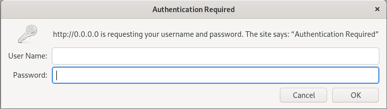
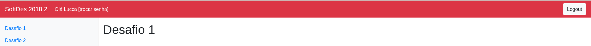
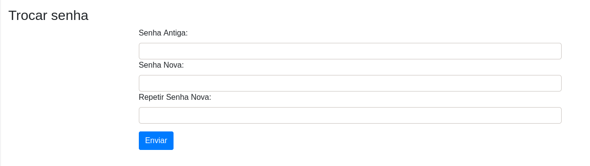
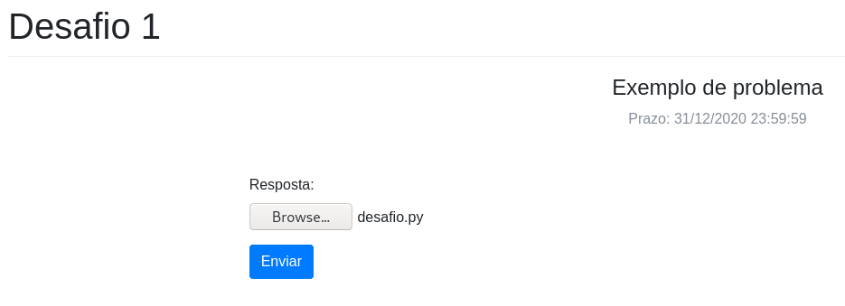
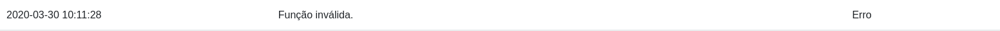
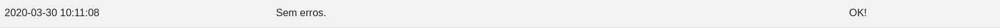

# Tutorial para alunos

## Logando no servidor

Para logar no servidor, basta acessar o link disponibilizado pelo professor que o levara para a tela de login:

No inicio sua senha sera a mesma que o nome de usuario, ao logar recomenda-se trocar a senha imediatamente:
Para isso basta clicar em [trocar senha] no canto superior esquerdo:

 
E realizar a troca de senha:

## Enviando desafio
Para realizar um envio basta encotrar o arquivo nos seus diretorios e clicar em enviar

### Errado
Caso a entrega nao esteja correta aparecera um feed back como o seguinte:

Ou caso o arquivo seja invalido:

### Correto
Caso a entrega esteja correta aparecera um feed back como o seguinte:
