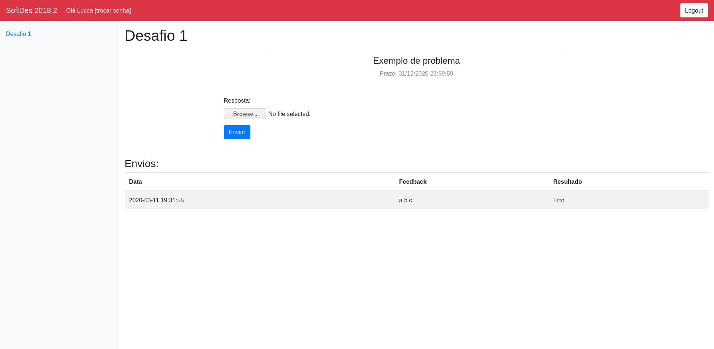

# Bem Vindo ao WebServer Desing de Software

Este e um software que tem por objetivo auxiliar alinos e professores na disciplina de design de sofware em no cumprimento das atividades.

## O ambiente

O ambiente proporcionado pelo software mostra para os alunos uma lista de desafios propostos pelo professor e, para cada um desses permite o envio de uma solucao e tambem a visualizacao de envios passados.

